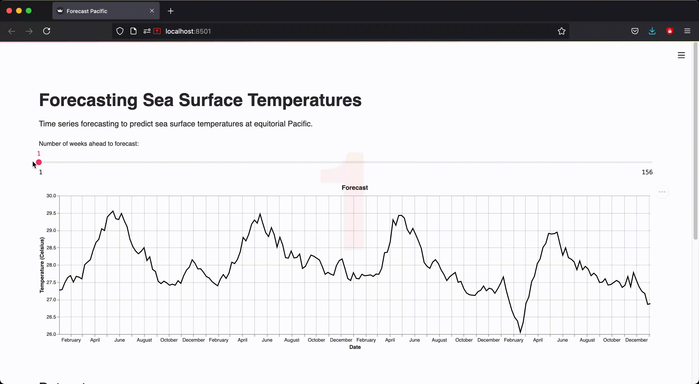

# Forecasting Sea Surface Temperature with ✨ ARIMA ✨

A small interactive web-app to visualise forecasting as you _slide_ the timeframe ahead!

## 🤔 What is it?
Implementation of ARIMA model to forecast sea surface temperatures at equitorial Pacific. All the heavy lifting of time-series data cleaning and training the model is already done for! Just hop on to the [web-app](https://share.streamlit.io/yashdeep01/time-series-forecasting/main) and view inference _live!_

## 🚀 [Open with Streamlit](https://share.streamlit.io/yashdeep01/time-series-forecasting/main)
Visualise the forecast on your browser. Tune the timeframe window as you watch your model **forecast**. 

[](https://share.streamlit.io/yashdeep01/time-series-forecasting/main)

## 💻 Run with Jupyter Notebook
### Create conda environment 🐍
> Install the anaconda package from [here](https://docs.anaconda.com/anaconda/install/) and run these commands on terminal:
```
conda init
conda create -n forecast python=3.8
conda activate forecast
```
### Clone this repo :octocat:
```
git clone https://github.com/yashdeep01/Time-Series-Forecasting.git
cd Time-Series-Forecasting/
pip install -r requirements.txt
```
### Run 🛠️
```
jupyter notebook
```
Your default browser must open up with Jupyter home page at `localhost:8888/tree`. Select `time-series.ipynb` in files and notebook opens in a new tab.

## Data 💾

Kaggle dataset: <https://www.kaggle.com/uciml/el-nino-dataset>

Dataset used here contains surface sea temperature readings taken daily from a series of buoys positioned at the equatorial Pacific. 
All readings were taken at the same time of the day. This data is used to understand and predict seasonal-to-inter annual 
climate variations originating in the tropics. Time series data used for training covers a span of 4 years — from 1 January, 1993 to 31 December, 1996. 
There are missing values in the data which are treated by linear interpolation here. 

## Info 📔
Find R script in this repo at [./script/arima_forecasting.R](https://github.com/yashdeep01/Time-Series-Forecasting/blob/main/script/arima_forecasting.R). Also find the implementation details (data deep dive, testing, modelling parameters) and theory at [./docs/Forecasting with ARIMA.pdf](https://github.com/yashdeep01/Time-Series-Forecasting/blob/main/docs/Forecasting%20with%20ARIMA.pdf).
